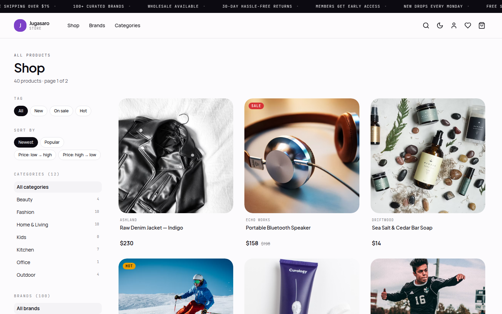
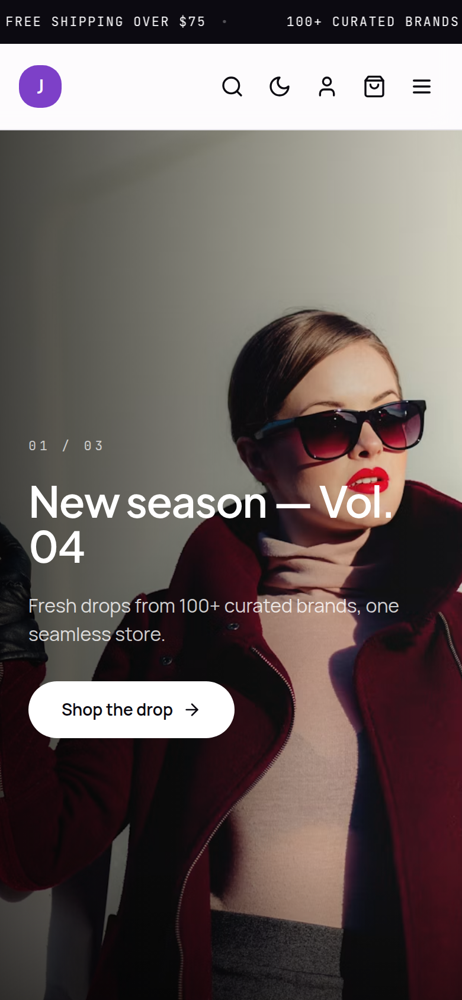

<h1 align="center">🛍️ Jugasaro Store</h1>

<p align="center"><strong>Full-stack e-commerce monorepo — storefront + complete admin panel, end-to-end typed.</strong></p>

<p align="center">
  
  
  
  
  
  
</p>

<p align="center">
  
</p>

## ✨ What's inside

- 🔐 **JWT auth with httpOnly cookies** — sign-up, login, roles, and a full **password-reset flow** (token + email).
- 🛒 **Persistent cart & wishlist**, checkout with **coupons, shipping methods and tax** (payment simulated — showcase system).
- 🎟️ **Coupons & promotions**: percent/fixed codes with min-subtotal, usage limits (global & per-user) and validity windows; redemptions audited and revenue tracked per coupon.
- 🚚 **Shipping methods** with free-above rules, chosen at checkout and snapshotted on the order, plus **tracking numbers** surfaced to the customer.
- ⭐ **Reviews with moderation**: verified-purchase detection, one per user/product, approved via the admin.
- 📦 **Inventory management**: stock decremented on checkout, **restocked on cancel/refund**, manual adjustments with an audit trail and low-stock alerts.
- 📈 **Sales reports**: daily revenue series, top products, sales by category and CSV export.
- 📧 **Transactional emails** (order confirmation, shipping updates, password reset) delivered to a demo **email outbox** in the admin.
- 🗂️ **Full admin panel**: products with variants/images, brands, categories, orders with status flow + tracking, coupons, shipping, reviews, inventory, reports, store settings, users — even the home hero carousel.
- 🧩 **Shared types package** (`packages/shared`) consumed by both API and web — one source of truth, end-to-end type safety.
- 📦 **Reproducible seed**: 40 products, shipping methods, coupons and sample reviews out of the box.

## 🧱 Architecture

```
jugasaro-store/
├── apps/
│   ├── api/          # NestJS 11 · Prisma 6 · PostgreSQL 16 · JWT (httpOnly)
│   └── web/          # Next.js 15 App Router · React 19 · Tailwind v4
├── packages/
│   └── shared/       # Shared TypeScript types (User, Product, Cart, Order, …)
├── docker-compose.yml
└── turbo.json        # pnpm workspaces + Turborepo
```

## 🚀 Quick start

> Requires Node 20.10+, pnpm 9+ and Docker.

```bash
pnpm install

# copy env templates (root, api, web)
cp .env.example .env
cp apps/api/.env.example apps/api/.env
cp apps/web/.env.example apps/web/.env

pnpm db:up        # PostgreSQL via Docker Compose
pnpm dev          # API on :4000, Web on :3000 (Turborepo)
```

Once running: Web → http://localhost:3000 · API health → http://localhost:4000/health · Swagger → http://localhost:4000/api/docs

## 📸 Screens

| Storefront detail | Mobile |
|---|---|
|  |  |

---

<p align="center">Built by <a href="https://github.com/joansaro">Andrés Santos</a> · <a href="https://joansaro.com">joansaro.com</a></p>
